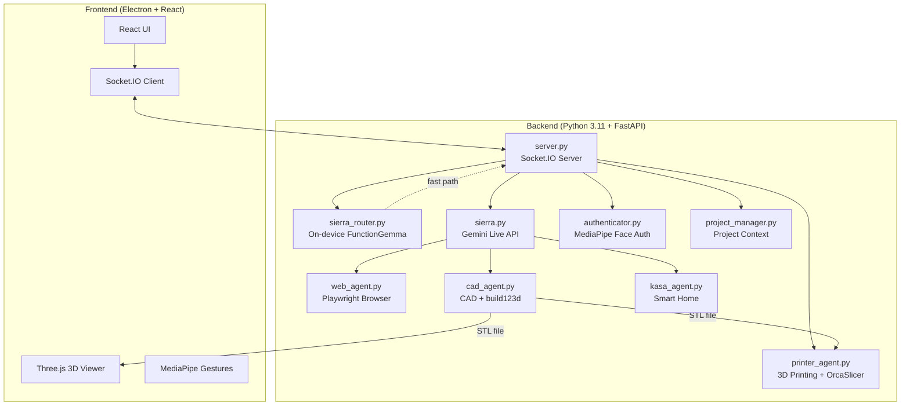

# Sierra — Multimodal AI Assistant (powered by Sierra-Ada v2 stack)


> **Sierra** is a multimodal AI assistant that combines Google's **Gemini 2.5 Native Audio** with an **on-device FunctionGemma router** for instant, private intent classification. CAD, browser, smart-home, gesture, and face-auth modules all run inside a single Electron desktop app.

Sierra is built on the open-source [A.D.A V2](https://github.com/nazirlouis/ada_v2) stack (Electron + React + FastAPI), upgraded with the [A.D.A Local](https://github.com/nazirlouis/ada_local) FunctionGemma router pattern and the [Mac7Moore/ada_model](https://huggingface.co/Mac7Moore/ada_model) LoRA adapter on top of [google/functiongemma-270m-it](https://huggingface.co/google/functiongemma-270m-it). See [`NOTICE.md`](./NOTICE.md) for full attribution.

---

## 🌟 Capabilities at a Glance

| Feature | Description | Technology |
|---------|-------------|------------|
| **🗣️ Low-Latency Voice** | Real-time conversation with interrupt handling | Gemini 2.5 Native Audio |
| **⚡ On-device Router** | 270M-param FunctionGemma classifies intents locally before forwarding to Gemini | `Mac7Moore/ada_model` LoRA → `functiongemma-270m-it` |
| **🧊 Parametric CAD** | Editable 3D model generation from voice prompts | `build123d` → STL |
| **🖨️ 3D Printing** | Slicing and wireless print job submission | OrcaSlicer + Moonraker/OctoPrint |
| **🖐️ Minority Report UI** | Gesture-controlled window manipulation | MediaPipe Hand Tracking |
| **👁️ Face Authentication** | Secure local biometric login | MediaPipe Face Landmarker |
| **🌐 Web Agent** | Autonomous browser automation | Playwright + Chromium |
| **🏠 Smart Home** | Voice control for TP-Link Kasa devices | `python-kasa` |
| **📁 Project Memory** | Persistent context across sessions | File-based JSON storage |

### 🖐️ Gesture Control Details

Sierra's "Minority Report" interface uses your webcam to detect hand gestures:

| Gesture | Action |
|---------|--------|
| 🤏 **Pinch** | Confirm action / click |
| ✋ **Open Palm** | Release the window |
| ✊ **Close Fist** | "Select" and grab a UI window to drag it |

> **Tip**: Enable the video feed window to see the hand tracking overlay.

---

## 🏗️ Architecture Overview



### ⚡ On-device router (the "ada v2" processing upgrade)

Every text utterance is run through [`backend/sierra_router.py`](backend/sierra_router.py) **before** it is forwarded to Gemini Live. The router uses the [Mac7Moore/ada_model](https://huggingface.co/Mac7Moore/ada_model) LoRA adapter on [google/functiongemma-270m-it](https://huggingface.co/google/functiongemma-270m-it) (~270M parameters) and emits a structured route:

```json
{
  "function": "control_light",
  "arguments": {"action": "on", "device_name": "kitchen"},
  "confidence": 0.94,
  "latency_ms": 78,
  "is_fallback": false
}
```

Benefits:

* **Lower latency** — well-defined intents (lights, timers, CAD prototypes, web search, project switching) can be dispatched on-device in tens of milliseconds instead of a full Gemini round-trip.
* **Privacy** — routing happens locally, so the model only sees structured intents, never raw conversational context.
* **Graceful fallback** — anything the router labels `chat` (or anything it's not confident about) falls through to Gemini Live, so multimodal voice/vision still works exactly as in upstream ADA V2.
* **Optional** — if `transformers` / `peft` aren't installed or the adapter can't be downloaded, the router silently disables itself and Sierra runs in Gemini-only mode.

The router warms up in a background thread at server startup. The first user utterance after launch may pay a one-time cold-start cost (downloading the ~50 MB adapter + the FunctionGemma base weights if not cached); all subsequent calls are warm.

A small `router` pill in the bottom-left of the UI shows the most recent route decision (intent + confidence + latency) so you can see at a glance what Sierra is doing on-device.

---

## ⚡ TL;DR Quick Start (Experienced Developers)

<details>
<summary>Click to expand quick setup commands</summary>

```bash
# 1. Clone and enter
git clone https://github.com/macmoore0603/Sierra.git && cd Sierra

# 2. Create Python environment (Python 3.11)
conda create -n sierra python=3.11 -y && conda activate sierra
brew install portaudio  # macOS only (for PyAudio)
pip install -r requirements.txt
playwright install chromium

# 3. Setup frontend
npm install

# 4. Create .env file
cp .env.example .env
# Edit .env and replace your_api_key_here with your real Gemini key

# 5. Run!
conda activate sierra && npm run dev
```

</details>

---

## 🛠️ Installation Requirements

### 🆕 Absolute Beginner Setup (Start Here)
If you have never coded before, follow these steps first!

**Step 1: Install Visual Studio Code (The Editor)**
- Download and install [VS Code](https://code.visualstudio.com/). This is where you will write code and run commands.

**Step 2: Install Anaconda (The Manager)**
- Download [Miniconda](https://docs.conda.io/en/latest/miniconda.html) (a lightweight version of Anaconda).
- This tool allows us to create isolated "playgrounds" (environments) for our code so different projects don't break each other.
- **Windows Users**: During install, check "Add Anaconda to my PATH environment variable" (even if it says not recommended, it makes things easier for beginners).

**Step 3: Install Git (The Downloader)**
- **Windows**: Download [Git for Windows](https://git-scm.com/download/win).
- **Mac**: Open the "Terminal" app (Cmd+Space, type Terminal) and type `git`. If not installed, it will ask to install developer tools—say yes.

**Step 4: Get the Code**
1. Open your terminal (or Command Prompt on Windows).
2. Type this command and hit Enter:
   ```bash
   git clone https://github.com/macmoore0603/Sierra.git
   ```
3. This creates a folder named `sierra`.

**Step 5: Open in VS Code**
1. Open VS Code.
2. Go to **File > Open Folder**.
3. Select the `sierra` folder you just downloaded.
4. Open the internal terminal: Press `Ctrl + ~` (tilde) or go to **Terminal > New Terminal**.

---

### ⚠️ Technical Prerequisites
Once you have the basics above, continue here.

### 1. System Dependencies

**MacOS:**
```bash
# Audio Input/Output support (PyAudio)
brew install portaudio
```

**Windows:**
- No additional system dependencies required!

### 2. Python Environment
Create a single Python 3.11 environment:

```bash
conda create -n sierra python=3.11
conda activate sierra

# Install all dependencies
pip install -r requirements.txt

# Install Playwright browsers
playwright install chromium
```

### 3. Frontend Setup
Requires **Node.js 18+** and **npm**. Download from [nodejs.org](https://nodejs.org/) if not installed.

```bash
# Verify Node is installed
node --version  # Should show v18.x or higher

# Install frontend dependencies
npm install
```

### 4. 🔐 Face Authentication Setup
To use the secure voice features, Sierra needs to know what you look like.

1. Take a clear photo of your face (or use an existing one).
2. Rename the file to `reference.jpg`.
3. Drag and drop this file into the `sierra/backend` folder.
4. (Optional) You can toggle this feature on/off in `settings.json` by changing `"face_auth_enabled": true/false`.

---

## ⚙️ Configuration (`settings.json`)

The system creates a `settings.json` file on first run. You can modify this to change behavior:

| Key | Type | Description |
| :--- | :--- | :--- |
| `face_auth_enabled` | `bool` | If `true`, blocks all AI interaction until your face is recognized via the camera. |
| `tool_permissions` | `obj` | Controls manual approval for specific tools. |
| `tool_permissions.generate_cad` | `bool` | If `true`, requires you to click "Confirm" on the UI before generating CAD. |
| `tool_permissions.run_web_agent` | `bool` | If `true`, requires confirmation before opening the browser agent. |
| `tool_permissions.write_file` | `bool` | **Critical**: Requires confirmation before the AI writes code/files to disk. |

---

### 5. 🖨️ 3D Printer Setup
Sierra V2 can slice STL files and send them directly to your 3D printer.

**Supported Hardware:**
- **Klipper/Moonraker** (Creality K1, Voron, etc.)
- **OctoPrint** instances
- **PrusaLink** (Experimental)

**Step 1: Install Slicer**
Sierra uses **OrcaSlicer** (recommended) or PrusaSlicer to generate G-code.
1. Download and install [OrcaSlicer](https://github.com/SoftFever/OrcaSlicer).
2. Run it once to ensure profiles are created.
3. Sierra automatically detects the installation path.

**Step 2: Connect Printer**
1. Ensure your printer and computer are on the **same Wi-Fi network**.
2. Open the **Printer Window** in Sierra (Cube icon).
3. Sierra automatically scans for printers using mDNS.
4. **Manual Connection**: If your printer isn't found, use the "Add Printer" button and enter the IP address (e.g., `192.168.1.50`).

---

### 6. 🔑 Gemini API Key Setup
Sierra uses Google's Gemini API for voice and intelligence. You need a free API key.

1. Go to [Google AI Studio](https://aistudio.google.com/app/apikey).
2. Sign in with your Google account.
3. Click **"Create API Key"** and copy the generated key.
4. Copy the example environment file to create your own `.env`:
   ```bash
   cp .env.example .env
   ```
5. Open `.env` in your editor and replace `your_api_key_here` with the key you copied:
   ```
   GEMINI_API_KEY=AIzaSy...
   ```
6. Save the file.

> **Note**: Keep this key private! The `.env` file is already listed in `.gitignore` and will never be committed to Git.

---

### 7. 🎙️ Voice Dependencies Setup

Sierra's real-time voice features rely on **PyAudio** and a working microphone. Follow the steps below for your platform.

#### macOS

1. **Install PortAudio** (required by PyAudio):
   ```bash
   brew install portaudio
   ```
   > If you don't have Homebrew, install it first: https://brew.sh

2. **Grant Microphone Permission**:
   - Open **System Settings → Privacy & Security → Microphone**.
   - Enable access for your terminal app (Terminal, iTerm2, VS Code, etc.).
   - If you are running Sierra via Electron, you may also need to allow the Electron app itself.
   - **Restart your terminal** after granting permission.

3. **Verify PyAudio installation**:
   ```bash
   conda activate sierra
   python -c "import pyaudio; print('PyAudio OK')"
   ```

#### Windows

- No extra system dependencies are required — `pip install pyaudio` handles everything.
- When Sierra starts, Windows will prompt for microphone access. Click **Allow**.

#### Linux

```bash
sudo apt-get install -y portaudio19-dev python3-pyaudio
```

#### `.env` file checklist

Before starting Sierra, make sure:
- [ ] `.env` file exists in the project root (same directory as `README.md`).
- [ ] `GEMINI_API_KEY` is set to a valid key (not the placeholder).
- [ ] No extra spaces or quotes around the key value.

---

## 🚀 Running Sierra V2

You have two options to run the app. Ensure your `sierra` environment is active!

### Option 1: The "Easy" Way (Single Terminal)
The app is smart enough to start the backend for you.
1. Open your terminal in the `sierra` folder.
2. Activate your environment: `conda activate sierra`
3. Run:
   ```bash
   npm run dev
   ```
4. The backend will start automatically in the background.

### Option 2: The "Developer" Way (Two Terminals)
Use this if you want to see the Python logs (recommended for debugging).

**Terminal 1 (Backend):**
```bash
conda activate sierra
python backend/server.py
```

**Terminal 2 (Frontend):**
```bash
# Environment doesn't matter here, but keep it simple
npm run dev
```

---

## ✅ First Flight Checklist (Things to Test)

1. **Voice Check**: Say "Hello Sierra". She should respond.
2. **Vision Check**: Look at the camera. If Face Auth is on, the lock screen should unlock.
3. **CAD Check**: Open the CAD window and say "Create a cube". Watch the logs.
4. **Web Check**: Open the Browser window and say "Go to Google".
5. **Smart Home**: If you have Kasa devices, say "Turn on the lights".

---

## ▶️ Commands & Tools Reference

### 🗣️ Voice Commands
- "Switch project to [Name]"
- "Create a new project called [Name]"
- "Turn on the [Room] light"
- "Make the light [Color]"
- "Pause audio" / "Stop audio"

### 🧊 3D CAD
- **Prompt**: "Create a 3D model of a hex bolt."
- **Iterate**: "Make the head thinner." (Requires previous context)
- **Files**: Saves to `projects/[ProjectName]/output.stl`.

### 🌐 Web Agent
- **Prompt**: "Go to Amazon and find a USB-C cable under $10."
- **Note**: The agent will auto-scroll, click, and type. Do not interfere with the browser window while it runs.

### 🖨️ Printing & Slicing
- **Auto-Discovery**: Sierra automatically finds printers on your network.
- **Slicing**: Click "Slice & Print" on any generated 3D model.
- **Profiles**: Sierra intelligently selects the correct OrcaSlicer profile based on your printer's name (e.g., "Creality K1").

---

## ❓ Troubleshooting FAQ

### Camera not working / Permission denied (Mac)
**Symptoms**: Error about camera access, or video feed shows black.

**Solution**:
1. Go to **System Preferences > Privacy & Security > Camera**.
2. Ensure your terminal app (e.g., Terminal, iTerm, VS Code) has camera access enabled.
3. Restart the app after granting permission.

---

### `GEMINI_API_KEY` not found / Authentication Error
**Symptoms**: Backend crashes on startup with "API key not found".

**Solution**:
1. Make sure your `.env` file is in the root `sierra` folder (not inside `backend/`).
2. Verify the format is exactly: `GEMINI_API_KEY=your_key` (no quotes, no spaces).
3. Restart the backend after editing the file.

---

### Voice doesn't connect / pure silence
**Symptoms**: Clicking the connect button does nothing; no voice response; the UI stays silent.

**Solution**:
1. Check the **terminal/console** for error messages — Sierra now surfaces connection errors in the UI and logs.
2. The most common cause is a **deprecated Gemini model**. Google rotates preview models every few months.
   - Open your `.env` file and add or update `GEMINI_MODEL` with a current model name:
     ```
     GEMINI_MODEL=models/gemini-2.5-flash-preview-native-audio
     ```
   - Check [Google's model list](https://ai.google.dev/gemini-api/docs/models) for the latest native-audio model.
3. Verify your API key is still valid at [Google AI Studio](https://aistudio.google.com/app/apikey).
4. Restart the backend after making changes.

---

### WebSocket connection errors (1011)
**Symptoms**: `websockets.exceptions.ConnectionClosedError: 1011 (internal error)`.

**Solution**:
This is a server-side issue from the Gemini API. Simply reconnect by clicking the connect button or saying "Hello Sierra" again. If it persists, check your internet connection or try again later.

---

## 📸 What It Looks Like

*Coming soon! Screenshots and demo videos will be added here.*

---

## 📂 Project Structure

```
sierra/
├── backend/                    # Python server & AI logic
│   ├── sierra.py               # Gemini Live API integration
│   ├── sierra_router.py        # On-device FunctionGemma router
│   ├── server.py               # FastAPI + Socket.IO server
│   ├── cad_agent.py            # CAD generation orchestrator
│   ├── printer_agent.py        # 3D printer discovery & slicing
│   ├── web_agent.py            # Playwright browser automation
│   ├── kasa_agent.py           # TP-Link smart home control
│   ├── authenticator.py        # MediaPipe face auth logic
│   ├── project_manager.py      # Project context management
│   ├── tools.py                # Tool definitions for Gemini
│   └── reference.jpg           # Your face photo (add this!)
├── src/                        # React frontend
│   ├── App.jsx                 # Main application component
│   ├── components/             # UI components (11 files)
│   └── index.css               # Global styles
├── electron/                   # Electron main process
│   └── main.js                 # Window & IPC setup
├── projects/                   # User project data (auto-created)
├── .env                        # API keys (create this!)
├── requirements.txt            # Python dependencies
├── package.json                # Node.js dependencies
└── README.md                   # You are here!
```

---

## ⚠️ Known Limitations

| Limitation | Details |
|------------|---------|
| **macOS & Windows** | Tested on macOS 14+ and Windows 10/11. Linux is untested. |
| **Camera Required** | Face auth and gesture control need a working webcam. |
| **Gemini API Quota** | Free tier has rate limits; heavy CAD iteration may hit limits. |
| **Network Dependency** | Requires internet for Gemini API (no offline mode). |
| **Single User** | Face auth recognizes one person (the `reference.jpg`). |

---

## 🤝 Contributing

Contributions are welcome! Here's how:

1. **Fork** the repository.
2. **Create a branch**: `git checkout -b feature/amazing-feature`
3. **Commit** your changes: `git commit -m 'Add amazing feature'`
4. **Push** to the branch: `git push origin feature/amazing-feature`
5. **Open a Pull Request** with a clear description.

### Development Tips

- Run the backend separately (`python backend/server.py`) to see Python logs.
- Use `npm run dev` without Electron during frontend development (faster reload).
- The `projects/` folder contains user data—don't commit it to Git.

---

## 🔒 Security Considerations

| Aspect | Implementation |
|--------|----------------|
| **API Keys** | Stored in `.env`, never committed to Git. |
| **Face Data** | Processed locally, never uploaded. |
| **Tool Confirmations** | Write/CAD/Web actions can require user approval. |
| **No Cloud Storage** | All project data stays on your machine. |

> [!WARNING]
> Never share your `.env` file or `reference.jpg`. These contain sensitive credentials and biometric data.

---

## 🙏 Acknowledgments

- **[Google Gemini](https://deepmind.google/technologies/gemini/)** — Native Audio API for real-time voice
- **[build123d](https://github.com/gumyr/build123d)** — Modern parametric CAD library
- **[MediaPipe](https://developers.google.com/mediapipe)** — Hand tracking, gesture recognition, and face authentication
- **[Playwright](https://playwright.dev/)** — Reliable browser automation

---

## 📄 License

This project is licensed under the **MIT License** — see the [LICENSE](LICENSE) file for details.

---

<p align="center">
  <strong>Sierra — built on the open-source <a href="https://github.com/nazirlouis/ada_v2">A.D.A V2</a> stack by Nazir Louis, extended with the <a href="https://github.com/nazirlouis/ada_local">A.D.A Local</a> Function-Gemma router and the <a href="https://huggingface.co/Mac7Moore/ada_model">Mac7Moore/ada_model</a> fine-tuned adapter on <a href="https://huggingface.co/google/functiongemma-270m-it">google/functiongemma-270m-it</a>.</strong><br>
  <em>Bridging AI, CAD, and Vision in a Single Interface</em>
</p>
